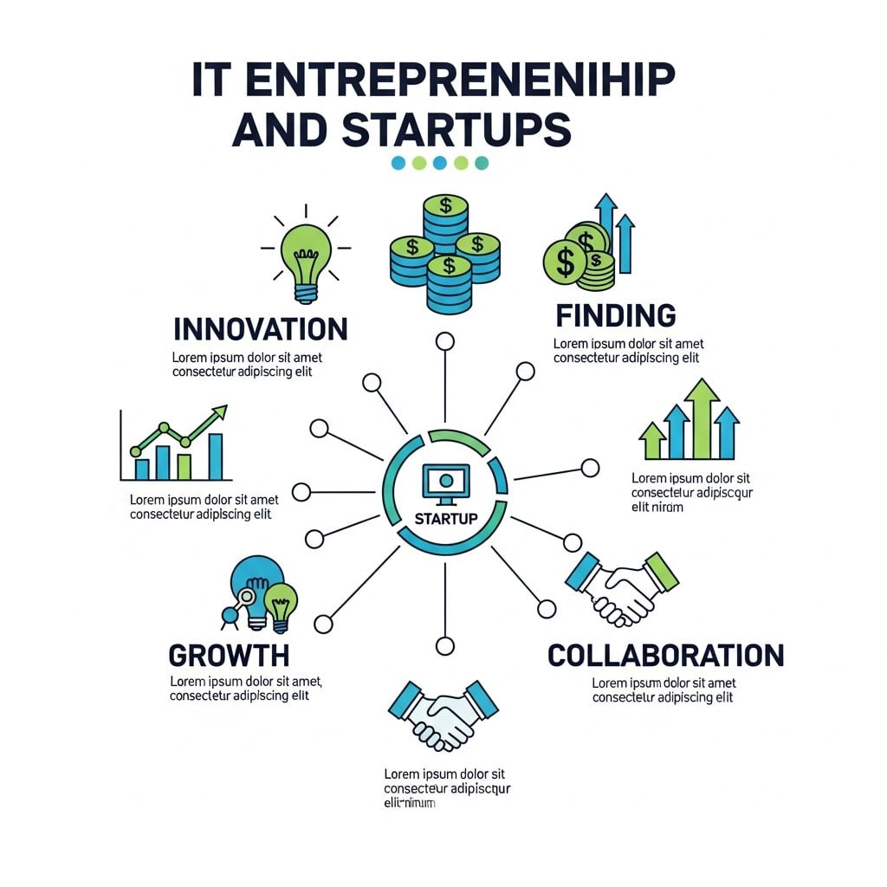

# 💡 IT-підприємництво та стартапи

## Опис курсу

Курс "IT-підприємництво та стартапи" розроблений для учнів 10–11 класів, які прагнуть розвинути підприємницьке мислення, навчитися працювати в команді, створювати власні IT-проєкти та знайомитися зі світом інновацій. Протягом курсу учні дізнаються, як народжується ідея стартапу, як її перевірити, втілити в життя та представити потенційним інвесторам.

---

## 🎯 Мета курсу

- Ознайомити учнів із поняттями стартапу, бізнес-моделі, MVP, пітч-деку
- Розвивати критичне мислення та навички вирішення проблем
- Формувати базові знання з маркетингу, фінансування та презентації проєктів
- Навчити використовувати цифрові інструменти для командної роботи над проєктами

---

## 🧭 Структура курсу

Курс складається з 8 основних модулів:

### 1. Вступ до IT-підприємництва
- Що таке стартап і як він відрізняється від традиційного бізнесу
- Приклади успішних українських та світових IT-стартапів

### 2. Генерація ідеї
- Визначення проблем
- Ідеація та оцінка ідей
- Принципи Design Thinking

### 3. Бізнес-модель і цільова аудиторія
- Lean Canvas
- Ціннісна пропозиція
- Користувацькі сегменти

### 4. MVP — мінімально життєздатний продукт
- Навіщо потрібен MVP
- Приклади MVP у різних сферах
- Побудова прототипу

### 5. Робота в команді та цифрові інструменти
- Організація проєктної діяльності
- Trello, Notion, Canva, Figma, Google Workspace
- Тайм-менеджмент та розподіл ролей

### 6. Маркетинг для стартапу
- Основи цифрового маркетингу
- Цільова аудиторія і канали комунікації
- Прості інструменти реклами

### 7. Презентація проєкту та залучення інвестицій
- Пітч-дек: структура та зміст
- Презентація перед аудиторією
- Типові помилки стартаперів

### 8. Практичний проєкт
- Командна робота над власним стартапом
- Прототипування, дизайн, презентація
- Підсумкова пітч-сесія

---

## 📌 Методи навчання

- Проєктно-орієнтоване навчання
- Командна робота
- Практичні завдання
- Вивчення кейсів з реального бізнесу

---

## 🛠 Інструменти

| Категорія        | Інструменти                         |
|------------------|--------------------------------------|
| Планування       | Trello, Notion                      |
| Прототипування   | Figma, Canva                        |
| Співпраця        | Google Docs, Google Slides          |
| Презентації      | Pitch, PowerPoint, Tilda            |

---

## 📖 Завершення курсу

Після проходження курсу учні:
- Зрозуміють базові принципи запуску стартапу
- Зможуть створити свою ідею та втілити її в MVP
- Навчаться ефективно презентувати свої проєкти

---

## 🔗 Додаткові ресурси

- [Lean Canvas онлайн](https://leanstack.com/leancanvas)
- [Прототипи в Figma](https://www.figma.com/)
- [Платформа Tilda для лендінгів](https://tilda.cc/)
- [Основи презентацій Pitch Deck](https://piktochart.com/blog/startup-pitch-deck-examples/)

---

> ⚠️ Всі матеріали призначені для некомерційного використання у навчальних цілях.
